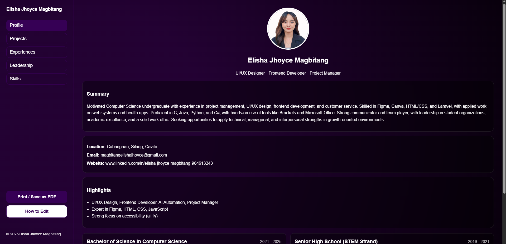

Portfolio (HTML/CSS/JS)
====================================

How to use
----------
1) Open index.html in your browser to view the portfolio.
2) Click the tabs in the left sidebar (Profile, Projects, Experiences, Leadership, Skills).
3) Use the "Print / Save as PDF" button to export a single-page resume-style PDF.

Customize your info
-------------------
- Edit your name, tagline, and details in index.html (search for "Your Name", "you@example.com", etc.).
- Add/remove Projects by duplicating the <article class="card project"> blocks in the Projects section.
- Update experiences inside the "timeline" items.
- Update skills inside the "Design" and "Development" lists.
- Styles live in styles.css; you can tweak spacing, borders, or font weights.
- Behavior (tab switching, year) is handled by script.js.

Deploy
------
- Drag these files to any static hosting (GitHub Pages, Netlify, Vercel) or open index.html locally.

Notes
-----
- Theme is deliberately black & purple: #000, #2f0a5aff, purple lines, and neutral accents.
- The layout is responsive and print-friendly.
- Accessible tab list with keyboard navigation (Home/End/Left/Right).

Enjoy! ✨

Preview Image
-----

